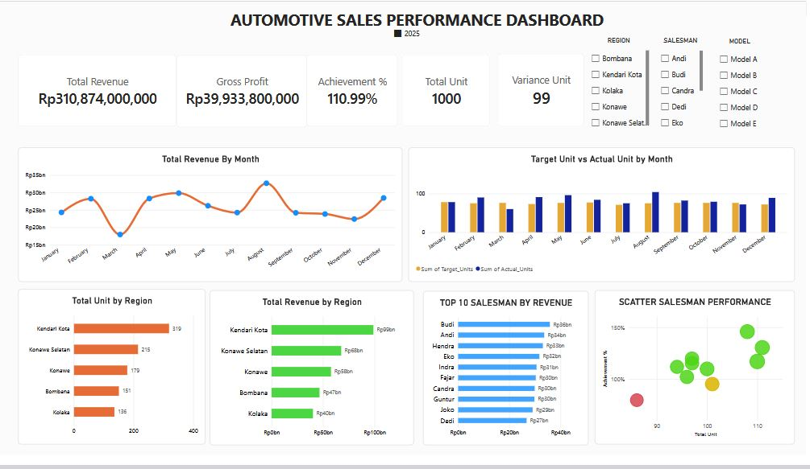
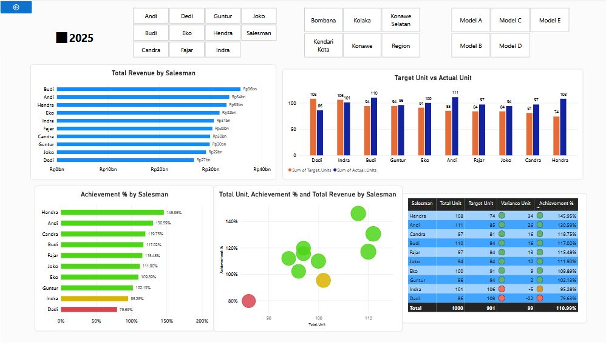

# 🚗 Automotive Sales Performance Dashboard

## 📊 Project Overview

This project analyzes automotive sales performance using Excel and Microsoft Power BI.

The dashboard was provides insights into sales revenue, unit sales, target achievement,
salesman performance, regional performance, and monthly sales trends.

The objective of this project is to support management in monitoring
sales performance and identifying areas that require improvement.

---

## 🎯 Business Problem

Sales management needs a faster and more effective way to:

- Monitor sales performance
- Compare actual sales against targets
- Identify top and underperforming salespeople
- Analyze regional sales performance
- Monitor monthly sales trends
- Identify performance gaps
- Support data-driven sales decisions

Previously, these analyses could require multiple manual reports.

This project provides an interactive dashboard that brings these analyses together
in one place.

---

## 🎯 Project Objectives

The main objectives of this project are:

1. Clean and prepare automotive sales data.
2. Build a structured data model.
3. Create sales performance KPIs.
4. Analyze salesman performance.
5. Analyze regional performance.
6. Compare target vs actual sales.
7. Build an interactive Power BI dashboard.
8. Generate business insights and recommendations.

---

## 🛠️ Tools & Technologies

- Microsoft Power BI
- Power Query
- DAX
- Microsoft Excel
- Data Modeling
- Data Visualization
- Business Analysis

---

## 🧹 Data Preparation

The data preparation process included:

- Data cleaning
- Removing/handling inconsistent values
- Standardizing data types
- Preparing date fields
- Preparing salesman reference data
- Preparing region reference data
- Preparing model reference data
- Preparing monthly target data

Power Query was used to transform the data before loading it into Power BI.

---

## 🏗️ Data Model

The Power BI model uses a fact-and-dimension structure.

### Fact Tables

- Sales Transaction
- Monthly Target

### Dimension / Reference Tables

- Date
- Month
- Salesman
- Region
- Model

The relationships were designed to allow consistent filtering and analysis across
different dimensions.

---

## 📐 Key KPIs

### Total Revenue

Measures the total sales value generated.

### Gross Profit

Measures the profitability based on revenue and estimated cost.

### Total Unit

Measures the actual number of vehicles sold.

### Target Unit

Represents the planned sales volume.

----

## 📊 Achievement & Variance

**Achievement %**

Achievement % digunakan untuk mengukur tingkat pencapaian actual sales terhadap target.

**Formula:**

> Achievement % = Actual Unit ÷ Target Unit × 100%

**Variance Unit**

Variance menunjukkan selisih antara actual sales dan target.

> Variance Unit = Actual Unit − Target Unit

**Interpretasi:**

- 🟢 **Achievement ≥ 100%** → Target tercapai atau terlampaui
- 🟡 **Achievement 90%–99%** → Mendekati target
- 🔴 **Achievement < 90%** → Perlu perhatian dan improvement

---

## 📈 Dashboard Features

### Executive Sales Overview

The dashboard provides:

- Total Revenue
- Gross Profit
- Total Unit
- Achievement %
- Variance Unit
- Monthly Revenue Trend
- Target vs Actual Unit
- Sales Performance by Region
- Sales Performance by Salesman
- Top 10 Salesman by Revenue

### Salesman Performance Analysis

This page provides:

- Revenue by Salesman
- Target vs Actual Unit
- Achievement % by Salesman
- Total Unit by Salesman
- Salesman Performance Matrix
- Interactive Salesman Analysis

---

## 📊 Dashboard Preview

### Executive Sales Overview



### Salesman Performance Analysis



## 💡 Business Insights

Based on the dashboard analysis:

1. Overall sales achievement is above the annual target.
2. Several salesmen consistently outperform their individual targets.
3. Some salesmen show achievement below target and require closer monitoring.
4. Sales performance varies between regions.
5. Monthly sales performance fluctuates and should be monitored to identify seasonal patterns.
6. High-performing salesmen can be used as benchmarks for improving team performance.

---

## 🎯 Business Recommendations

### 1. Improve Low-Performing Salesmen

Conduct regular coaching, field accompaniment, and performance monitoring
for salesmen whose achievement remains below target.

### 2. Replicate High Performer Strategies

Identify the sales activities and customer approaches used by top-performing
salesmen and share them with the rest of the team.

### 3. Strengthen Regional Strategy

Allocate sales resources based on regional performance and market potential.

### 4. Improve Customer Database

Strengthen customer database management and follow-up activities to increase
conversion opportunities.

### 5. Monitor Monthly Performance

Use monthly sales trends to identify periods of declining performance and
prepare corrective actions earlier.

---

## 📂 Project Structure

```text
automotive-sales/
│
├── README.md
│
├── data/
│   └── automotive_sales_data.xlsx
│
├── dashboard/
│   ├── executive-sales-overview.png
│   └── salesman-performance.png
│
└── powerbi/
    └── automotive-sales-dashboard.pbix
```

---

## 👨‍💻 Author

**Djusran**

Data Analyst | Sales & Automotive Business

Project: **Automotive Sales Performance Dashboard**
